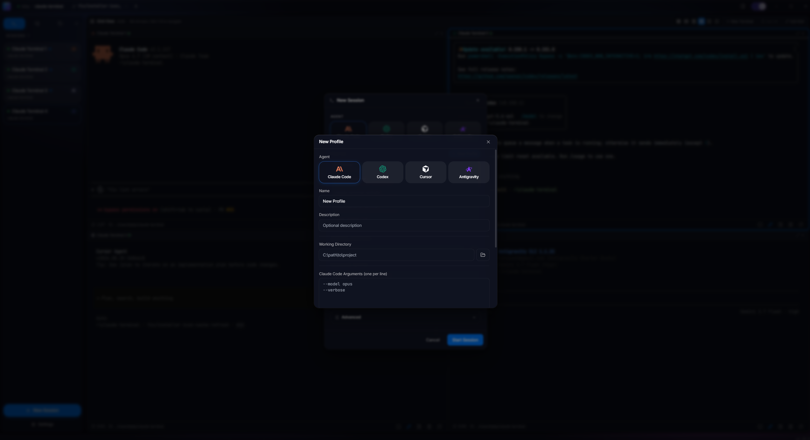

<p align="center">
  
</p>

<h1 align="center">Agentrium</h1>

<p align="center">
  <strong>Run Claude Code, Codex, Cursor, and Antigravity side by side in one native desktop app.</strong>
</p>

<p align="center">
  <a href="#supported-agents">Agents</a> •
  <a href="#features">Features</a> •
  <a href="#installation">Installation</a> •
  <a href="#usage">Usage</a> •
  <a href="#keyboard-shortcuts">Shortcuts</a> •
  <a href="#building-from-source">Build</a> •
  <a href="#license">License</a>
</p>

<p align="center">
  
  
  
  
  
</p>

---

## Overview

**Agentrium** (Agent Desktop Environment) is a cross-platform desktop app for developers who work with multiple coding-agent CLIs. Pick which agent each terminal launches, mix them freely in tabs or a grid, save per-profile setups, and get a native window with proper tabs, split view, session restore, git worktree lifecycle, and hunk review on top.

The app is Tauri-native (small binary, no Electron bloat) and ships to Windows and macOS.

## Supported Agents

Each terminal you spawn can target any of the four agents below. Switch between them with a picker in the New Terminal dialog; the icon on each tab and grid cell tells you which agent is running.

| Agent | Binary | Install | Docs |
|---|---|---|---|
| **Claude Code** | `claude` | `npm install -g @anthropic-ai/claude-code` | [docs.claude.com/claude-code](https://docs.claude.com/claude-code) |
| **Codex** | `codex` | `npm install -g @openai/codex` | [github.com/openai/codex](https://github.com/openai/codex) |
| **Cursor** | `agent` | `curl https://cursor.com/install -fsS \| bash` (or `irm 'https://cursor.com/install?win32=true' \| iex` on Windows) | [cursor.com/cli](https://cursor.com/cli) |
| **Antigravity** | `agy` | `curl -fsSL https://antigravity.google/cli/install.sh \| bash` | [antigravity.google/docs/cli](https://antigravity.google/docs/cli/install/) |

Only Claude Code is required to get started. The other three are opt-in and auto-detected once installed - Settings > Updates shows what's on your PATH.

## Screenshots

<p align="center">
  
  <br><em>Welcome screen - pick Claude Code, Codex, Cursor, or Antigravity to start your first session</em>
</p>

<p align="center">
  
  <br><em>New Session dialog - pick the agent, choose a profile, set working directory, model, and nickname</em>
</p>

<p align="center">
  
  <br><em>Grid view - Claude Code, Codex, Cursor, and Antigravity running side by side; brand icon on each cell shows which agent is active</em>
</p>

<p align="center">
  
  <br><em>New Profile dialog - name, working directory, and per-agent CLI arguments; profiles work across all four agents</em>
</p>

<p align="center">
   Appearance" width="800">
  <br><em>Settings - theme, density, accent color, UI font scale, reduce-motion, and tab-bar behavior</em>
</p>

## Features

### Multi-agent architecture

- Pick per terminal between Claude Code, Codex, Cursor, and Antigravity
- Brand icon on every tab and every grid cell so you always know what's running
- Per-agent default arguments in Settings; per-profile args stored in SQLite
- Claude-only flags (`--dangerously-skip-permissions`, `--model`, `--effort`, `--continue`, `--resume`, `--worktree`) are stripped automatically when spawning other agents so profiles are portable
- Per-agent version detection in Settings > About and Settings > Updates
- Agents are auto-detected via `<binary> --version` first, then a PATH probe fallback so CLIs without a semver flag still register as installed

### Multi-terminal management

- Tabbed strip with drag-to-reorder, pin, and multi-select tear-off
- Brand icon prefix on every tab title
- Custom nicknames per terminal
- Session state persistence across restarts
- Overflow chevron with a hidden-tabs dropdown for busy workspaces

### Smart grid view

- Up to 8 terminals in one window with mixable agents per cell
- Layout picker with schematic icons that match the actual grid shape (1x1, 1x2, 2x1, 2x2, 1x3, 3x1, 2x3, 3x2, 2x4, 4x2)
- Layout preserves your manual pick until it's actually full - adding a 3rd terminal to a 2x2 grid stays 2x2, not 1x3
- Click to focus, arrow keys to navigate, `Ctrl+G` to toggle
- Cell headers auto-clean stale terminal references after a restart

### Configuration profiles

- Save named profiles with a working directory, per-agent arguments, and env vars
- Profiles are agent-agnostic in the picker - the same profile appears whether Claude Code, Codex, Cursor, or Antigravity is selected
- SQLite storage, transparent migration for existing profiles

### Git worktree lifecycle

- Create, list, and switch worktrees from the New Terminal dialog
- Close a terminal that was on a worktree and choose merge (fast-forward), squash-merge, or discard from a dialog
- Branch chip in the tab strip shows current + upstream status

### Hunk review

- IntelliJ-style verified review cockpit for staging individual hunks
- Diff view with hunk-level accept/reject
- Changelists for grouping related diffs

### Session restore

- App-restart re-attaches Claude Code conversations by session id (`--resume <id>` or `--continue`)
- Workspace save/load for storing a named layout of terminals
- Ephemeral tab state survives a `/clear`

### Modern UI/UX

- Flat IntelliJ IDEA 2026.1 "New UI"-style design (dark and light themes, user-set accent color)
- WCAG AA text contrast, reduce-motion support that follows the OS setting
- Compact / comfortable / spacious density
- UI font scale
- Custom frameless window with a transparent titlebar

### Auto-updates

- Automatic app update checks on startup with a background download
- Manual Recheck for each agent CLI in Settings > Updates

### Command hints, snippets, prompt editor

- Built-in Claude Code command reference (Codex/Cursor/Antigravity hint packs planned)
- Snippet manager with import/export
- Full prompt editor drawer for composing large multi-line prompts

## Installation

### Prerequisites

Before installing Agentrium, ensure you have:

1. **Node.js** (v22 LTS or higher) - [Download](https://nodejs.org/)
2. At least one of the following agents installed (see [Supported Agents](#supported-agents) above for install commands):
   - Claude Code (recommended - detected by the setup wizard)
   - Codex
   - Cursor
   - Antigravity

### Download

Download the latest release for your platform from the [Releases page](https://github.com/talayash/agentrium/releases/latest):

| Platform | Installer | Description |
|---|---|---|
| Windows | [Agentrium_1.33.4_x64-setup.exe](https://github.com/talayash/agentrium/releases/latest/download/Agentrium_1.33.4_x64-setup.exe) | NSIS Installer (Recommended) |
| Windows | [Agentrium_1.33.4_x64_en-US.msi](https://github.com/talayash/agentrium/releases/latest/download/Agentrium_1.33.4_x64_en-US.msi) | MSI Installer |
| macOS (Apple Silicon) | [Agentrium_1.33.4_aarch64.dmg](https://github.com/talayash/agentrium/releases/latest/download/Agentrium_1.33.4_aarch64.dmg) | DMG for M1/M2/M3/M4 Macs |
| macOS (Intel) | [Agentrium_1.33.4_x64.dmg](https://github.com/talayash/agentrium/releases/latest/download/Agentrium_1.33.4_x64.dmg) | DMG for Intel Macs |

> Existing 1.31.x installs auto-update to 1.32.0 via the in-app updater. The bundle identifier is unchanged, so profiles, workspaces, and session history carry over. Pre-rebrand 1.31.x download artifacts are still available on the release history if you need an older build.

> macOS builds are currently not code-signed/notarized - first launch will require right-click > Open or approval in System Settings > Privacy & Security.

### First Launch

1. Run the installer and follow the setup wizard
2. Launch Agentrium from the Start Menu or Desktop
3. The setup wizard detects Node.js and Claude Code; if either is missing it guides you through the install
4. Click "New Terminal", pick your agent from the four brand buttons, and launch your first session

## Usage

### Creating a terminal

1. Click **New Terminal** in the sidebar, or press `Ctrl+Shift+N`
2. Pick the **agent** from the four brand buttons (Claude Code / Codex / Cursor / Antigravity)
3. Optionally pick a **profile** from the grid
4. Optionally set a **nickname** for easy identification
5. Choose the **working directory** for the session
6. Add per-agent **arguments** in the textarea (placeholder text hints at typical flags per agent)
7. Click **Start Terminal**

### Managing terminals

- **Switch**: click a tab or a sidebar row
- **Rename**: double-click the terminal name or use the context menu
- **Duplicate**: right-click > Duplicate, or `Ctrl+Shift+D` - the duplicate keeps the same agent
- **Restart**: bottom status bar > Restart - the restarted terminal keeps the same agent
- **Close**: click X on the tab or use the context menu
- **Search**: use the sidebar search bar to filter terminals

### Configuration profiles

1. Click **Manage Profiles** in the sidebar footer (or click **+ Add Profile** in the New Terminal dialog)
2. Create a new profile with:
   - Name and description
   - Working directory
   - Agent-flavored arguments (e.g., `--model opus` for Claude, `--dangerously-bypass-approvals-and-sandbox` for Codex)
   - Environment variables
3. Save and use the profile for new terminals - it appears under every agent

### Hints panel

Press `F1` or click the lightbulb icon to open the Hints panel:
- Categorized Claude Code commands
- Click any hint to copy it to clipboard
- Search bar for filtering
- Codex/Cursor/Antigravity hint packs are planned

## Keyboard Shortcuts

| Shortcut | Action |
|----------|--------|
| `Ctrl+Shift+N` | New Terminal |
| `Ctrl+Shift+D` | Duplicate current terminal (keeps agent) |
| `Ctrl+W` | Close current terminal |
| `Ctrl+B` | Toggle sidebar |
| `F1` | Toggle Hints panel |
| `Ctrl+,` | Open Settings |
| `Ctrl+P` | Search Everywhere |
| `Ctrl+Tab` | Next terminal |
| `Ctrl+Shift+Tab` | Previous terminal |
| `Ctrl+G` | Toggle Grid view |
| `Ctrl+Shift+G` | Add current terminal to grid |
| `Ctrl+C` | Copy selected text / send interrupt |
| `Ctrl+V` | Paste from clipboard |
| `Arrow keys` | Navigate grid (in grid mode) |

## Building from Source

### Prerequisites

- [Node.js](https://nodejs.org/) v22+
- [Rust](https://rustup.rs/) (latest stable)
- [Visual Studio Build Tools](https://visualstudio.microsoft.com/visual-cpp-build-tools/) (Windows)

### Steps

1. **Clone the repository**
   ```bash
   git clone https://github.com/talayash/agentrium.git
   cd claude-terminal
   ```

2. **Install dependencies**
   ```bash
   npm install
   ```

3. **Run in development mode**
   ```bash
   npm run tauri dev
   ```

4. **Build for production**
   ```bash
   npm run tauri build
   ```

   Installers land in:
   - `src-tauri/target/release/bundle/nsis/` (NSIS installer, Windows)
   - `src-tauri/target/release/bundle/msi/` (MSI installer, Windows)
   - `src-tauri/target/release/bundle/dmg/` (DMG, macOS)
   - `src-tauri/target/release/bundle/macos/` (`.app`, macOS)

## Tech Stack

| Layer | Technology |
|-------|------------|
| Framework | [Tauri](https://tauri.app/) 2.x |
| Backend | Rust (edition 2021) |
| Frontend | React 18 + TypeScript |
| Styling | Tailwind CSS + Framer Motion |
| Terminal | xterm.js (`@xterm/xterm` + fit / search / web-links / webgl addons) |
| State | Zustand (persisted via `zustand/middleware/persist`) |
| Database | SQLite via `rusqlite` (bundled) |
| PTY | `portable-pty` |
| Notifications | `notify-rust` |
| Icons | Lucide React + inline brand SVGs (simple-icons for Anthropic / Cursor, official OpenAI mark for Codex, original mark for Antigravity) |
| Build | Vite |

## Project Structure

```
claude-terminal/
├── src/                              # React frontend
│   ├── components/                   # UI (TitleBar, TerminalTabs, TerminalGrid, ...)
│   │   ├── AgentPicker.tsx           # Four-button agent picker
│   │   ├── BrandIcon.tsx             # Shared per-agent brand SVGs
│   │   └── settings/                 # Settings modal + category pages
│   ├── lib/
│   │   └── agents.ts                 # AgentKind, AGENT_SPECS catalog, filterArgsForAgent
│   ├── store/                        # Zustand stores
│   └── hooks/                        # Custom hooks
├── src-tauri/                        # Tauri backend
│   ├── src/
│   │   ├── main.rs                   # App setup, plugin registration, IPC dispatch
│   │   ├── agents.rs                 # AgentSpec catalog (mirror of TS)
│   │   ├── config.rs                 # ConfigProfile + AgentKind enum
│   │   ├── terminal.rs               # PTY lifecycle, per-agent spawn routing
│   │   ├── commands.rs               # All Tauri #[command] handlers
│   │   └── database.rs               # SQLite (profiles, workspaces, session_history)
│   └── icons/                        # App icons
└── package.json
```

## Troubleshooting

### Security warnings on first launch

The installers are signed with code-signing certificates, but new releases may
still trigger OS-level warnings until trust reputation accumulates. The app is
not actually damaged or unsafe - these are platform-level checks against
unrecognized binaries.

#### Windows - "Windows protected your PC" (SmartScreen)

Windows SmartScreen blocks executables downloaded from the internet until they
build up reputation, even when correctly signed.

1. When the blue SmartScreen dialog appears, click **More info**.
2. Click **Run anyway**.

If you also see a yellow "Unknown publisher" UAC prompt, the installer was
likely downloaded from an older release before code signing was enabled - grab
the latest installer from the
[Releases page](https://github.com/talayash/agentrium/releases/latest).

#### macOS - "Agentrium is damaged and can't be opened"

This message is misleading: the app is intact, but the macOS `.dmg` is not yet
notarized through Apple's notary service, so Gatekeeper rejects it after the
browser tags the download with a quarantine attribute. Remove the attribute
from Terminal:

```bash
# Before opening the DMG
xattr -d com.apple.quarantine ~/Downloads/Agentrium_*.dmg

# Or, if you've already dragged the app to /Applications
xattr -cr /Applications/Agentrium.app
```

Then open the app normally. The right-click > **Open** workaround does not
work for the "damaged" variant of the error - only `xattr` does.

> Proper Apple notarization is tracked in
> [#25](https://github.com/talayash/agentrium/issues/25); once it lands,
> these steps will no longer be required on macOS.

### An agent CLI shows "Not installed"

1. Verify the binary is on PATH: `which claude` / `where claude` (or the binary name for the agent you're checking).
2. Restart Agentrium so the app inherits the updated PATH.
3. Click **Recheck** on that agent's row in Settings > Updates.

If the binary is on PATH but Agentrium still can't detect a version, the agent probably doesn't expose one via `--version`. Agentrium falls back to a PATH probe in that case and marks the agent as **installed** anyway.

### Claude Code not detected during setup

1. Ensure Node.js is installed: `node --version`
2. Install Claude Code globally: `npm install -g @anthropic-ai/claude-code`
3. Restart Agentrium

### Terminal not responding

1. Check that the agent CLI is authenticated (each agent has its own login flow)
2. Try closing and reopening the terminal
3. Check the agent's own logs for errors

### Build errors

1. Ensure Rust is installed: `rustc --version`
2. Update Rust: `rustup update`
3. Clean and rebuild: `cargo clean && npm run tauri build`

## Contributing

Contributions are welcome. Please open a Pull Request.

1. Fork the repository
2. Create your feature branch (`git checkout -b feature/amazing-feature`)
3. Commit your changes (`git commit -m 'Add amazing feature'`)
4. Push to the branch (`git push origin feature/amazing-feature`)
5. Open a Pull Request

## License

This project is licensed under the MIT License - see the [LICENSE](LICENSE) file for details.

## Acknowledgments

- [Anthropic](https://www.anthropic.com/) for Claude Code
- [OpenAI](https://openai.com/) for Codex
- [Cursor](https://cursor.com/) for the Cursor CLI
- [Google](https://antigravity.google/) for the Antigravity CLI
- [Tauri](https://tauri.app/) for the framework
- [xterm.js](https://xtermjs.org/) for terminal emulation
- [simple-icons](https://simpleicons.org/) for the brand marks

---

<p align="center">
  Made for developers who juggle multiple coding agents.
</p>
